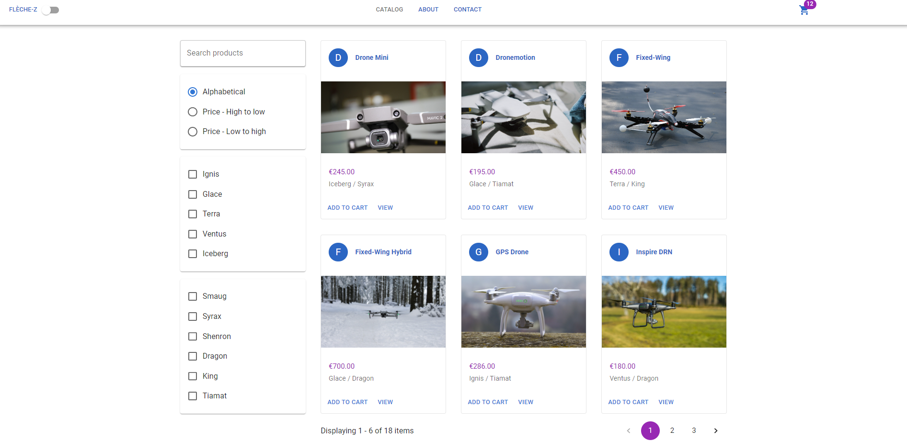

# Fleche-Z

* #### E-Commerce Project with TypeScript, Node, React & Redux 
* #### MVC _ Model-View-Controller Architectural Pattern with .NET & C#
* #### Building a RESTful API with .NET Controllers
* #### Entity Framework Migrations, DTOs (Data Transfer Objects)
***

| Frontend     | Database  | Backend|
| :---         |:---------:|  ---:  |
| React        |   SQLite  |  .NET  |
| Node         |           |  C#    |
| TypeScript   |           |  MVC   |
| Redux        |           |  EF    |
| Material UI  |           |  DTO   |

***

## [See the DEMO](https://flechez.fly.dev/)

## Environmental variable

## Packages
```
Redux - State Management Library | Redux-React
```
```
Material UI
```
```
React Router Dom 
```
```
React-Toastify
```
```
Axios
```


***



